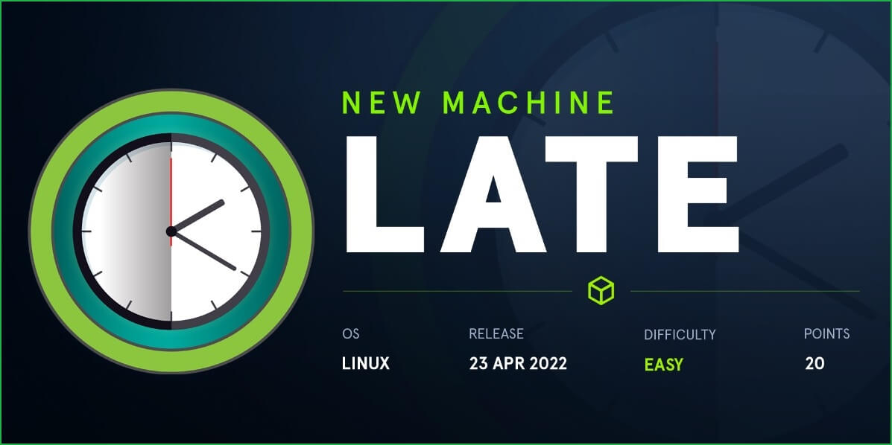
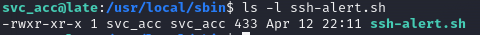
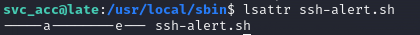

# 🏳 Late

<figure><figcaption></figcaption></figure>

<table><thead><tr><th width="227">Datos</th><th width="288.3333333333333"> </th><th>Notas</th></tr></thead><tbody><tr><td>Nombre de la máquina: </td><td><a href="https://app.hackthebox.com/machines/463">Late</a></td><td></td></tr><tr><td>IP de la máquina:</td><td>10.10.11.156</td><td></td></tr><tr><td>Sistema simulado: </td><td>Ubuntu</td><td></td></tr><tr><td>Servicio vulnerado: </td><td>Flask</td><td></td></tr></tbody></table>

### 1. Enumeración y descubrimiento

Comenzamos el ejercicio realizando un scan sobre la IP de la máquina para ver que servicios están corriendo en ella.

<figure><figcaption></figcaption></figure>

Podemos ver la siguiente página sobre la cual empezaremos a trabajar

<figure><figcaption></figcaption></figure>

Visitando la web nos encontramos el servicio images.late.htb dentro de la página en el apartado de edición online de la misma. Pudiendo observar lo siguiente y analizando la posibilidad de aprovecharnos del espacio de [subida de archivos en Flask](https://medium.com/@nyomanpradipta120/ssti-in-flask-jinja2-20b068fdaeee) para ejecutar código.

<figure><figcaption></figcaption></figure>

Observamos que lo que hace la máquina es convertir las imagenes que volcamos a texto, por lo que vamos a intentar introducir un payload para explotar la vulnerabilidad de ssti que creemos que puede funcionar en la máquina.&#x20;

Hacemos una prueba mediante el Payload 7\*7 mediante una imagen y nos devolverá un fichero results en el que nos figurará un fichero en el cual aparece ejecutaca la operación, por lo que es vulnerable a STSI.

<figure><figcaption></figcaption></figure>

### 2. Escalada al sistema

Vamos a ejecutar un payload para conseguir ver la clave rsa privada del usuario de la máquina. Para ello usaremos este repositorio para sacar el [payload](https://github.com/swisskyrepo/PayloadsAllTheThings/tree/master/Server%20Side%20Template%20Injection#jinja2---remote-code-execution) con el que ver la clave RSA privada.&#x20;

En este punto podremos ver el usuario de la máquina y la clave privada RSA.

<figure><figcaption></figcaption></figure>

```bash
ssh svc_acc@10.10.11.156 -i id_rsa.txt 
```

<figure><figcaption></figcaption></figure>

En este punto podremos ver la flag del usuario.

### 3. Escalada de privilegios

Llegados a este punto investigamos que formas de escalado tenemos y nos percatamos de que se ejecuta por root el script que se encuentra en la ruta `/usr/local/sbin/ssh-alert.sh` .

<figure><figcaption></figcaption></figure>

Vemos los permisos del fichero y observamos que nuestro usuario es propietario por lo que podemos modificar le script.&#x20;

<figure><figcaption></figcaption></figure>

Pero al ir a modificarlo vemos que no tyenemos permiso por lo que tenemos que realizar un analisis más exahustivo, lo cual nos señala que no podemos sobrescribir el fichero.&#x20;

<figure><figcaption></figcaption></figure>

POr ello lo que hacemos es ejecutar un append en el cual hace que root ejecute el script asignando privileguios a la bash y obtengamos su uid temporalmente.

```bash
echo "chmod u+s /bin/bash" >> ssh-alert.sh 
```

En este punto saldremos y volveremos a entrar en la máquina y tras ello ejecutaremos bash -p y obtendremos acceso a la máquina como root.

<figure><figcaption></figcaption></figure>

Tras ello tendremos acceso a la flag de root y completariamos el reto.&#x20;


Si te he ayudado sígueme y apóyame en [Hack The Box ](https://app.hackthebox.com/profile/819073)

