# 🏳 OpenAdmin

<figure><figcaption></figcaption></figure>

<table><thead><tr><th width="227">Datos</th><th width="288.3333333333333"> </th><th>Notas</th></tr></thead><tbody><tr><td>Nombre de la máquina: </td><td><a href="https://app.hackthebox.com/machines/222">OpenAdmin</a></td><td></td></tr><tr><td>IP de la máquina:</td><td>10.10.10.171</td><td></td></tr><tr><td>Sistema simulado: </td><td>Ubuntu Server</td><td></td></tr><tr><td>Servicio vulnerado: </td><td>Open Net Admin 18.1.1</td><td></td></tr><tr><td>EDB-ID:</td><td>47691</td><td></td></tr></tbody></table>

### 1. Enumeración y descubrimiento

Comenzamos el ejercicio realizando un scan sobre los puertos abiertos de la IP 10.10.10.171 con NMAP.

<figure>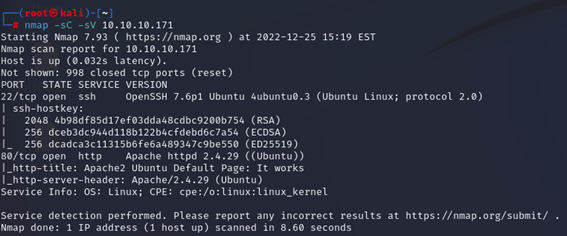<figcaption></figcaption></figure>

Al meternos por el puerto 80 en la IP podemos encontrar la siguiente página web que nos indica que tenemos un servicio Apache 2 de Ubuntu funcionando.

<figure>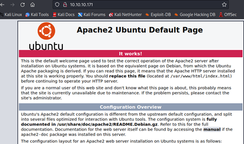<figcaption></figcaption></figure>

Ejecutamos la herramienta FFuF para buscar los directorios del servicio apache, encontrando algunas carpetas como Music o Artwork. Al intentar logearnos dentro de la web que aparece en 10.10.10.171/music aparece el subdominio “ona”, siglas para Open Net Admin.

Buscamos dentro del subdominio 10.10.10.171/ona y encontramos un panel de control de Open Net Admin. Dentro de este panel nos encontramos la versión del sistema.

<figure>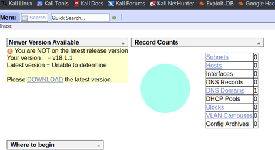<figcaption></figcaption></figure>

Para la versión 18.1.1 de Open Net Admin encontramos una vulnerabilidad conocida que permite la ejecución de código remoto y está encuadrada en el ID de Exploit Database como la 47691.

<figure>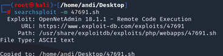<figcaption></figcaption></figure>

Examinamos el exploit buscando entender el funcionamiento del mismo. Una vez analizado, decidimos modificar una petición curl introduciendo parte del código con el objetivo de realizar una rever Shell.

<figure>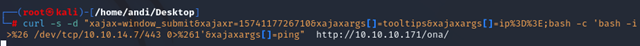<figcaption></figcaption></figure>

Nos ponemos en escucha por el puerto 443, consiguiendo establecer conexión y tener así la revershell en funcionamiento.

<figure>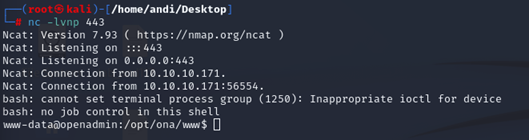<figcaption></figcaption></figure>

Comprobamos el directorio /home, pero nos percatamos de que no tenemos permisos para acceder a las carpetas de Jimmy ni Joanna.

<figure>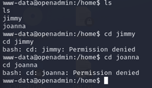<figcaption></figcaption></figure>

Vamos a buscar el archivo de configuración de la base de datos de ONA para poder ver la contraseña del usuario. En este caso, será “n1nj4W4rri0R!”.&#x20;

<figure>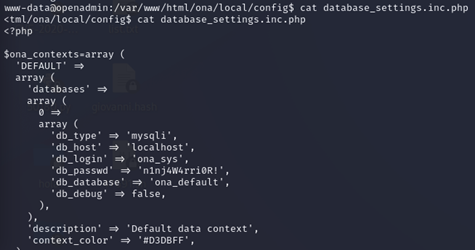<figcaption></figcaption></figure>

Con esta contraseña iniciamos sesión como el usuario Jimmy.

<figure>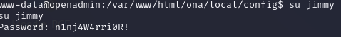<figcaption></figcaption></figure>

Una vez accedemos al usuario Jimmy podemos acceder a algunos directorios para los que no teníamos permisos previamente. Investigando encontramos el archivo internal.conf que tiene un Vhost en el 127.0.0.1:52846 con internal.openadmin.htb desplegado y asignado a Joanna.

<figure>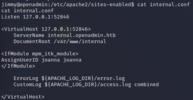<figcaption></figcaption></figure>

EN este punto accedemos mediante SSH al sitio interno.

<figure>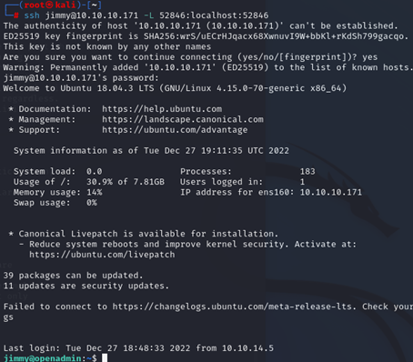<figcaption></figcaption></figure>

### 2. Escalada de privilegios

Llegados a este punto, encontramos un portal interno:

<figure>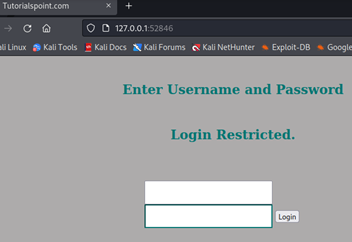<figcaption></figcaption></figure>

Para conseguir insertar código como Joanna, vamos a insertar un archivo php en la web, el cual nos permitirá, mediante la url inyectar código.

<figure>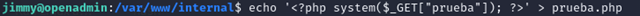<figcaption></figcaption></figure>

Realizamos una prueba y vemos que podemos ejecutar código como Joanna.

<figure>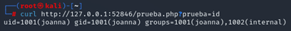<figcaption></figcaption></figure>

Llegado este punto encodeamos mediante la herramienta cyberchef el comando que queremos ejecutar para establecer una revershell que nos permita el acceso al usuario de Joanna.

<figure>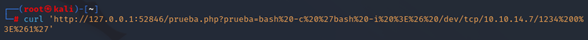<figcaption></figcaption></figure>

Una vez lanzamos esta petición, conseguiremos una revershell como Joanna en el puerto 1234.

<figure>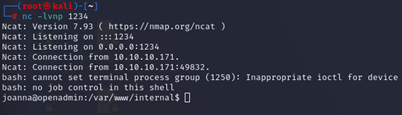<figcaption></figcaption></figure>

Examinando los archivos PHP que tenemos resulta viable ver la contraseña de Joanna.

<figure>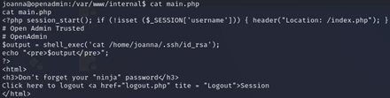<figcaption></figcaption></figure>

Lanzamos una petición por curl para ver el contenido de la clave RSA.

<figure>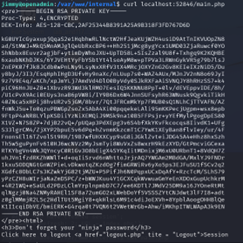<figcaption></figcaption></figure>

Utilizaremos ssh2jon para conseguir el hash.

<figure>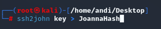<figcaption></figcaption></figure>

Tras utilizar John, conseguimos la contraseña “bloodninjas” para el usuario Joanna.

<figure>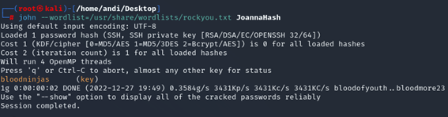<figcaption></figcaption></figure>

Una vez obtenida la contraseña nos conectamos mediante SSH al usuario Joanna.

<figure>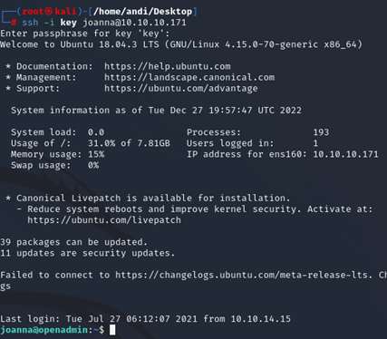<figcaption></figcaption></figure>

Realizamos sudo -l y descubrimos que Nano lo podemos usar como sudo y tenemos acceso al directorio priv. Es porque lo que ejecutamos /opt/priv y al pulsar cntrl R y cntrl X conseguimos ejecutar código.

<figure><figcaption></figcaption></figure>

<figure>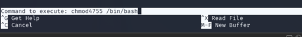<figcaption></figcaption></figure>

Y con ello conseguimos dar privilegios a /bin/bash ya que tenemos el suid.

<figure><figcaption></figcaption></figure>

Ejecutamos el comando bash -p y conseguimos acceso.

<figure><figcaption></figcaption></figure>


Si te he ayudado sígueme y apóyame en [Hack The Box ](https://app.hackthebox.com/profile/819073)

