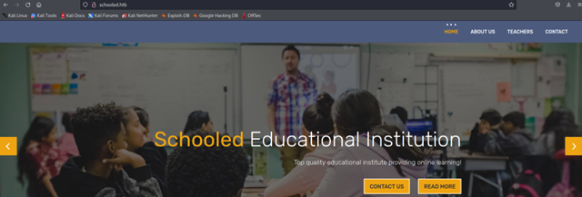

# 🏁 Schooled

<figure><figcaption></figcaption></figure>

<table><thead><tr><th width="227">Datos</th><th width="288.3333333333333"> </th><th>Notas</th></tr></thead><tbody><tr><td>Nombre de la máquina: </td><td><a href="https://app.hackthebox.com/machines/335">Schooled</a></td><td></td></tr><tr><td>IP de la máquina:</td><td>10.10.10.234</td><td></td></tr><tr><td>Sistema simulado: </td><td>Free BSD</td><td></td></tr><tr><td>Servicio vulnerado: </td><td>Moodle 3.9</td><td></td></tr><tr><td>CVEs:</td><td><a href="https://nvd.nist.gov/vuln/detail/CVE-2020-25627">CVE 2020-25627</a> y <a href="https://nvd.nist.gov/vuln/detail/CVE-2020-14321">CVE 2020-14321</a></td><td></td></tr></tbody></table>

### 1. Enumeración y descubrimiento

Comenzamos el ejercicio realizando un scan sobre la IP de la máquina schooled, detectando algunos servicios corriendo en los puertos 22, 80 y 33060.

<figure><figcaption></figcaption></figure>

Navegamos por el puerto 80 y nos encontramos el portal web de un colegio.

<figure><figcaption></figcaption></figure>

Tras una comprobación rápida no encontramos nada interesante a primera vista. Es por eso que vamos a aplicar fuzzing de cara a buscar subdominios que nos puedan dar algo de información.

<figure><figcaption></figcaption></figure>

Descubrimos que tiene un servicio Moodle montado en Moodle.schooled.htb.

<figure><figcaption></figcaption></figure>

Creamos un usuario en la plataforma y nos enrolamos en alguno de sus cursos. En nuestro caso, iremos al curso de matemáticas y seguiremos buscando información. Vamos a los participantes del curso y filtramos por los dos roles que parecen interesantes “course creator” y “teacher”. Encontrando el perfil de Manuel Philips.

<figure><figcaption></figcaption></figure>

Buscamos la versión de Moodle activa mediante el archivo ubicado en /Moodle/lib/upgrade.txt dando con la versión 3.9, la cual tiene la vulnerabilidad CVE 2020-25627 relacionada con inyección XSS.

<figure><figcaption></figcaption></figure>

Mediante ese CVE podremos aprovecharnos de la vulnerabilidad en el apartado “MoodleNet Profile” de nuestro perfil de usuario, por lo que inyectamos código y levantamos un netcat para conseguir la cookie de Manuel Philips.

<figure><figcaption></figcaption></figure>

<figure><figcaption></figcaption></figure>

Inyectamos la cookie de Manuel Philips y conseguimos iniciar sesión con su usuario

<figure><figcaption></figcaption></figure>

Ahora nos aprovecharemos de la vulnerabilidad CVE2020-14321 para conseguir el rol de manager. Para ello utilizaremos Burpsuite para modificar el parámetro de ID y asignarnos el rol necesario.

<figure><figcaption></figcaption></figure>

En ese momento pasaremos a tener el rol de manager:

<figure><figcaption></figcaption></figure>

En este momento buscaremos el usuario de “Lianna Carter” e iniciaremos sesión en él como administrador pulsando en la parte inferior del panel.

<figure><figcaption></figcaption></figure>

Después tendremos que subir RCE preparado para Moodle a la plataforma el cual activaremos iniciando el módulo de plugin en el que se monta el archivo.

<figure><figcaption></figcaption></figure>

Una vez realizado esto podremos realizar consultas al archivo que hemos subido como plugin consiguiendo ejecutar código remoto.

<figure><figcaption></figcaption></figure>

Ejecutamos código remoto codificando la generación de una revershell desde el navegador.

<figure><figcaption></figcaption></figure>

Esto hará que consigamos acceso en el servicio NetCat que hemos levantado.

<figure><figcaption></figcaption></figure>

Una vez realicemos este paso, accedemos al archivo config.php de Moodle y encontramos una pass para acceder a la base de datos.

<figure><figcaption></figcaption></figure>

Accedemos a la base de datos MySQL con la contraseña y buscando los usuarios y contraseñas de la tabla mdl\_user.

<figure><figcaption></figcaption></figure>

Una vez tenemos el hash del usuario administrador solo tenemos que utilizar JohnTheRiper para, mediante el diccionario rockyou.txt, localizar la clave de administrador del usuario “admin”.

<figure><figcaption></figcaption></figure>

Pasados unos minutos el software nos devolverá la contraseña correcta. Una vez realizado esto iniciaremos sesión con el usuario “jamie” y accederemos al sistema FreeBSD.

<figure><figcaption></figcaption></figure>

### 2. Escalada de privilegios

En este punto debemos de comenzar con el proceso de escalada de privilegios. Realizando una investigación nos damos cuenta de que nosotros podemos crear un paquete malicioso para, mediante los permisos de pkg que tenemos proporcionados, instalar una revershell con privilegios de root.

<figure><figcaption></figcaption></figure>

Es necesario asegurarse de dar permisos de escritura al script. Este script nos permitirá generar una revershell y estando en escucha en nuestro NetCat iniciar sesión como root, obteniendo acceso como administrador al sistema.

<figure><figcaption></figcaption></figure>


Si te he ayudado sígueme y apóyame en [Hack The Box ](https://app.hackthebox.com/profile/819073)

