# 🏳 Bastion


<figure><figcaption></figcaption></figure>

<table><thead><tr><th width="227">Datos</th><th width="288.3333333333333"> </th><th>Notas</th></tr></thead><tbody><tr><td>Nombre de la máquina: </td><td><a href="https://app.hackthebox.com/machines/186">Bastion</a></td><td></td></tr><tr><td>IP de la máquina:</td><td>10.10.10.134</td><td></td></tr><tr><td>Sistema simulado: </td><td>Windows Server 2008</td><td></td></tr><tr><td>Servicio vulnerado: </td><td>SMB</td><td></td></tr><tr><td>CVEs:</td><td></td><td></td></tr></tbody></table>

### 1. Enumeración y descubrimiento

Comenzamos el ejercicio realizando una fase de enumeración sobre la máquina, en la cual encontramos en la IP 10.10.10.134 mediante NMAP un servicio SMB.&#x20;

```bash
nmap -A 10.10.10.134
```

<figure>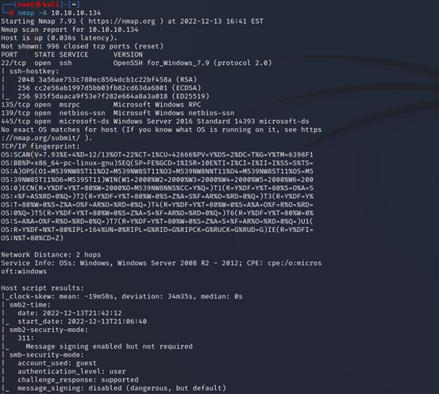<figcaption></figcaption></figure>

<figure>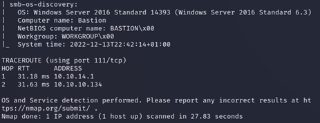<figcaption></figcaption></figure>

En este punto utilizaremos la herramienta SMBCLIENT para listar los servicios disponibles en la máquina.

```bash
smbclient --list 10.10.10.134 -U
```

<figure>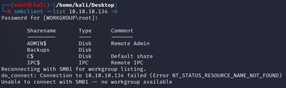<figcaption></figcaption></figure>

Accedemos al SMB y listamos los archivos dentro de "Backups".

<figure>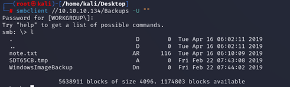<figcaption></figcaption></figure>

Observamos que está el archivo "note.txt" el cual nos llama la atención y nos decargamos usando `get note.txt .`Al ver el archivo nos enteramos de lo siguiente:

<figure>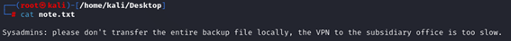<figcaption></figcaption></figure>

Seguimos analizando el fichero Backup llegando a los archivos VHD del backup.&#x20;

<figure>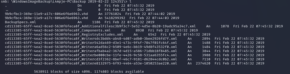<figcaption></figcaption></figure>

### 2. Explotación

En este paso montaremos el backup en nuestro sistema de cara a intentar dumpear las credenciales.&#x20;

<figure>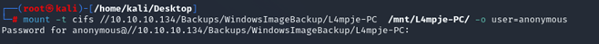<figcaption></figcaption></figure>

<figure>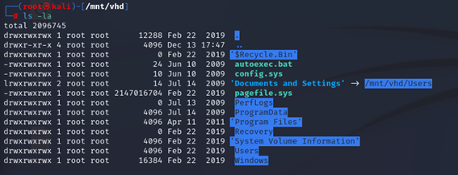<figcaption></figcaption></figure>

En este punto accedemos hasta le directorio config hasta llegar a SAM.

<figure>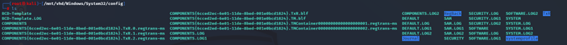<figcaption></figcaption></figure>

USaremos la herramienta`samdump2` de cara a recuperar la contraseña del usuario

<figure>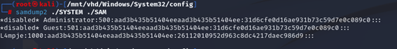<figcaption></figcaption></figure>

En este momento mediante [crackstation ](https://crackstation.net/)extraeremos la contraseña

<figure>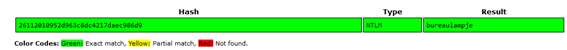<figcaption></figcaption></figure>

Una vez tenemos la contraseña nos conectaremos por SSH y acederemos a la flag del usuario.

<figure>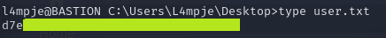<figcaption></figcaption></figure>

### 3. Escalada de privilegios Root

Tras realizar una investigación de los diferentes archivos que se encuentran en los directorios nos encontramos que este usuario tiene “mRemoteNG” instalado en su PC.

<figure>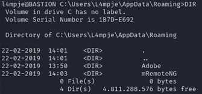<figcaption></figcaption></figure>

Allí encontraremos un archivo que puede contener información de configuración relevante.

<figure>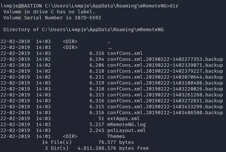<figcaption></figcaption></figure>

Nos descargaremos en este punto el archivo confCons.xml para examinarlo. Dentro del XML observamos que el fichereo se utiliza para conectar en RDP como administrador.&#x20;

<figure>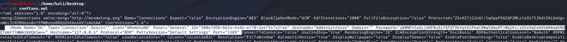<figcaption></figcaption></figure>

Revisamos la contraseña, la cual parece estar en Base64. Al intentar desencriptarla con [CyberChef ](https://gchq.github.io/CyberChef/)no lo conseguimos, es por ello que buscamos cual es el modo de desencriptado de la contraseña de mRemoteNG. Encontramos que existe una herramienta en Python llamada [mRemoteNG Decrypt ](https://github.com/kmahyyg/mremoteng-decrypt)con la cual desencriptamos la contraseña.

<figure>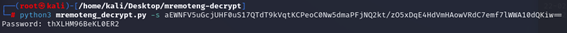<figcaption></figcaption></figure>

Ya con la contraseña nos conectamos como administradores a la máquina y visualizamos la flag.&#x20;

<figure>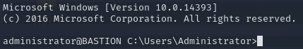<figcaption></figcaption></figure>


En ocasiones la herramienta mRemoteNG Decrypt da fallos, sobre todo si no se utiliza correctamente. Te recomiendo ver el [blog de vk9-sec](https://vk9-sec.com/exploiting-mremoteng/) sobre la herramienta en caso de que te de problemas.



Si te he ayudado sígueme y apóyame en [Hack The Box ](https://app.hackthebox.com/profile/819073)

