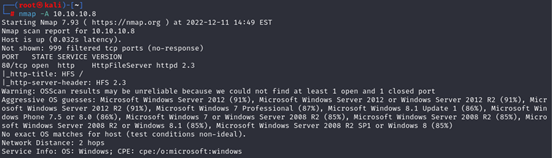
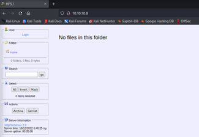
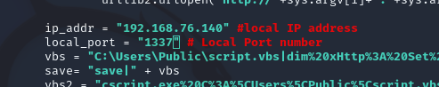
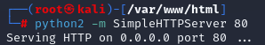
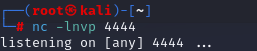
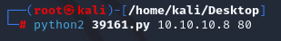
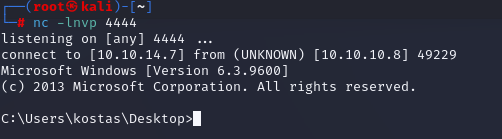
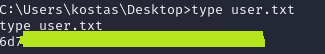
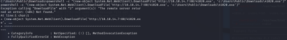

# 🏳 Optimum


<figure><figcaption></figcaption></figure>

<table><thead><tr><th width="227">Datos</th><th width="288.3333333333333"> </th><th>Notas</th></tr></thead><tbody><tr><td>Nombre de la máquina: </td><td><a href="https://app.hackthebox.com/machines/6">Optimum</a></td><td></td></tr><tr><td>IP de la máquina:</td><td>10.10.10.8</td><td></td></tr><tr><td>Sistema simulado: </td><td>Windows Server 2012</td><td></td></tr><tr><td>Servicio vulnerado: </td><td>HTTP File Server (HFS)</td><td></td></tr><tr><td>CVEs:</td><td><a href="https://nvd.nist.gov/vuln/detail/CVE-2014-6287">CVE 2014-6287</a></td><td></td></tr></tbody></table>

### 1. Enumeración y descubrimiento

Lo primero que hacemos es lanzar un nmap -A para averiguar que puertos se encuentran abiertos con servicio y cuál es el SO al que nos enfrentamos, en nuestro caso se detecta un Windows Server 2012.

```bash
nmap -A 10.10.10.8
```

<figure><figcaption></figcaption></figure>

Al intentar acceder a la IP que nos señalan encontramos lo siguiente:

<figure><figcaption></figcaption></figure>

### 2. Explotación

Nos hemos encontrado con un servidor de ficheros HTTP de COLERRIESGOSA el cual tiene una versión 2.3 del software HttpFileServer (HFS). Utilizaremos el [Exploit 39161 del CVE 2014-6287](https://www.exploit-db.com/exploits/39161) . Modificamos las líneas del exploit introduciendo la IP a la que debe apuntar.

<figure><figcaption></figcaption></figure>

Desplegamos un servicio HTTP en Python2 en el puerto 80 tal y como explican en el exploit.

<figure><figcaption></figcaption></figure>

Ponemos mediante NetCat la maquina en escucha en el puerto 4444.

<figure><figcaption></figcaption></figure>

Ejecutamos el exploit descargado previamente.

<figure><figcaption></figcaption></figure>

Ejecutamos el exploit apuntando a la IP del equipo objetivo y en ese momento en nuestro NetCat aparecerá que se escucha el servicio, estableciendo una Shell con el usuario Kostas

<figure><figcaption></figcaption></figure>

En ese momento podremos ver la Flag del usuario para le reto de HTB.

<figure><figcaption></figcaption></figure>

### 3. Escalada de privilegios Root

Tras esto utilizamos el [exploit 41020](https://www.exploit-db.com/exploits/41020) para ganar privilegios dentro del sistema y así vulnerar las medidas de seguridad desplegadas. Este exploit lo movemos a la máquina mediante un servidor HTTP en Python.

<figure><figcaption></figcaption></figure>

Una vez tenemos el exploit lo ejecutamos en la máquina. Nos desplazamos hasta la carpeta de administrador y visualizamos la flag.



Si te he ayudado sígueme y apóyame en [Hack The Box ](https://app.hackthebox.com/profile/819073)

