# 🏁 Fuse

<figure><figcaption></figcaption></figure>

<table><thead><tr><th width="227">Datos</th><th width="288.3333333333333"> </th><th>Notas</th></tr></thead><tbody><tr><td>Nombre de la máquina: </td><td><a href="https://app.hackthebox.com/machines/256">Fuse</a></td><td></td></tr><tr><td>IP de la máquina:</td><td>10.10.10.193</td><td></td></tr><tr><td>Sistema simulado: </td><td>Windows Server 2016</td><td></td></tr><tr><td>Servicio vulnerado: </td><td>Paper Cut</td><td></td></tr><tr><td>CVEs:</td><td></td><td></td></tr></tbody></table>

### 1. Enumeración y descubrimiento

Comenzamos el ejercicio realizando un escaneo de los puertos desplegados en la máquina Fuse

<figure><figcaption></figcaption></figure>

Accedemos a la página web y nos encontramos la aplicación PaperCut.

<figure>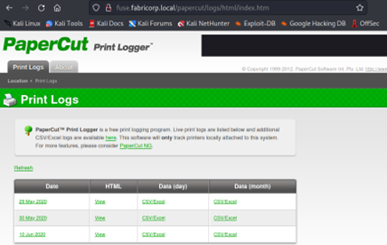<figcaption></figcaption></figure>

Pulsando los diferentes días encontramos las diferentes impresiones que han sido realizadas y, con ello, algunos usuarios que se encuentran visibles para nosotros y los cuales recogeremos en un archivo por si fusen útiles más adelante.

<figure>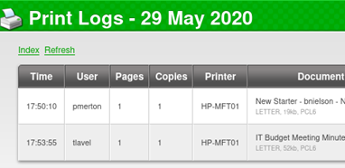<figcaption></figcaption></figure>

<figure>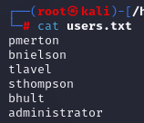<figcaption></figcaption></figure>

Revisando los documentos que han sido impresos nos encontramos el fichero “Fabricorp01” impreso por el usuario “Sthompson”, la cual nos puede dar una pista acerca de la posible contraseña.

<figure>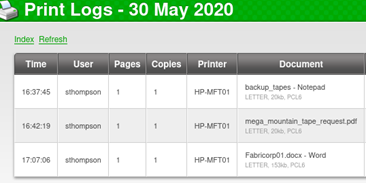<figcaption></figcaption></figure>

Utilizando la herramienta “[crackmapexec](https://github.com/Porchetta-Industries/CrackMapExec)” buscamos sobre nuestra lista de usuarios la contraseña y encontramos que es la contraseña de los usuarios “bnielson”, “tlavel” y “bhult”.

<figure>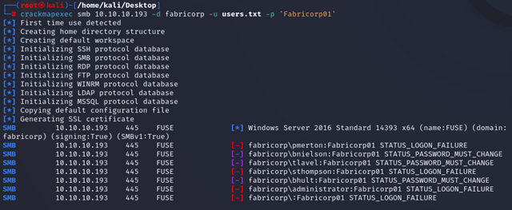<figcaption></figcaption></figure>

Al tratar de iniciar sesión con el usuario “bhult”, la respuesta indica que la contraseña debe ser cambiada, por lo que cambiaremos la contraseña de “Fabricorp01” a “Paper2!”.

<figure>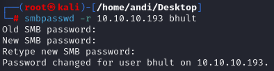<figcaption></figcaption></figure>

Nos percatamos de que, a los pocos segundos de realizar cualquier acción, la contraseña se cambia sola. Por ello, elaboramos un pequeño script que cambiará la contraseña automáticamente para conseguir ejecutar el comando smbmap.

<figure>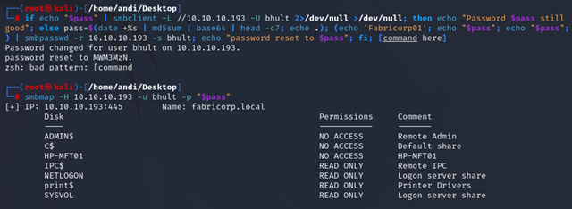<figcaption></figcaption></figure>

No encontramos gran cosa en el SMB por lo que vamos a intentar conectarnos al servicio RCP. Volvemos a ejecutar el script y ejecutamos el comando. Esto hace posible encontrar el nombre de algunos usuarios:

<figure>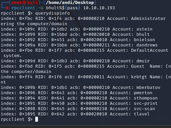<figcaption></figcaption></figure>

Utilizamos el comando enumprinters para enumerar las impresoras y nos encontramos con la contraseña de la misma además de su modelo, que es “$fab@s3Rv1ce$1”.

<figure>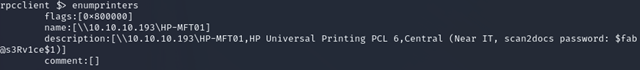<figcaption></figcaption></figure>

Intentamos realizar un smbmap sobre el usuario que nos aparece con la contraseña, pero no es posible acceder.

<figure>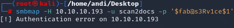<figcaption></figcaption></figure>

Es por ello que generamos una lista de usuarios con todos los conocidos hasta el momento y probamos mediante crackmapexec si encontramos alguno que pueda acceder.  El usuario “svc-print” nos permite acceder con la contraseña. Accedemos al SMB y no vemos información relevante. Es por ello que pasamos a comprobar si algún usuario podría acceder con la contraseña a una sesión por Evil-WinRM y “svc-print” parece dar acceso.

<figure>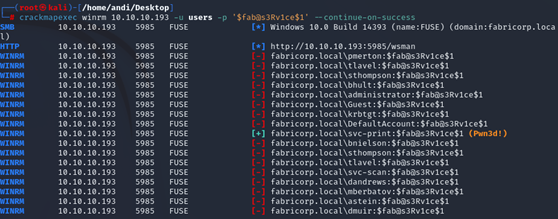<figcaption></figcaption></figure>

Iniciamos una Shell con Evil-WinRM con svc-print con la contraseña.

<figure>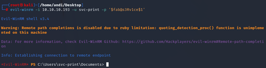<figcaption></figcaption></figure>

Con esto obtendríamos la flag y pasaríamos a la elevación de privilegios.

### 2. Escalada de privilegios

Comenzamos la escalada de privilegios investigando qué privilegios tenemos actualmente.

<figure>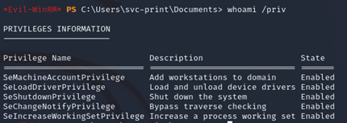<figcaption></figcaption></figure>

Tras una investigación, nos percatamos de que SeLoadDriverPrivilege puede ser vulnerado y analizamos la existencia de un paper por parte de la empresa Tarlogic que muestra cómo hacerlo. En primer lugar, nos hacemos con el Driver vulnerable, así como con la herramienta [EoPLoadDriver](https://github.com/TarlogicSecurity/EoPLoadDriver) que nos servirá, tras compilarlo, para poder conseguir acceso.

<figure>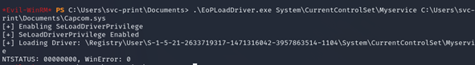<figcaption></figcaption></figure>


Es muy importante para la realización de esta máquina estudiar la [PoC de Tarlogic](https://www.tarlogic.com/es/blog/explotacion-seloaddriverprivilege/) sobre el SeLoadDriverPrivilege.&#x20;


Debemos de crear, con msfvenom, una revershell para Windows que apunte a nosotros.

<figure>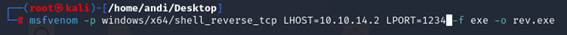<figcaption></figcaption></figure>

Esta revershell la subimos a la máquina para poder ejecutarla, ya que hemos modificado el driver malicioso para abrir este fichero y generarnos una revershell.

<figure>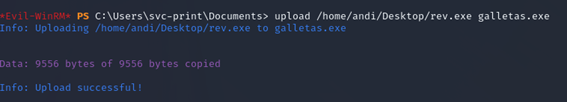<figcaption></figcaption></figure>

En este momento tendremos varios archivos correctamente configurados en un directorio de la máquina.

<figure><figcaption></figcaption></figure>

Ejecutaremos el exploit que hemos compilado para que se suba el driver vulnerable y aprovecharnos de una vulnerabilidad para abrir una revershell en nuestra máquina.

<figure>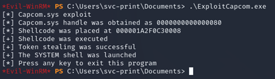<figcaption></figcaption></figure>

Si esto funciona correctamente, obtendremos la revershell con privilegios en nuestra máquina, finalizando con ello la escalada de privilegios.

<figure>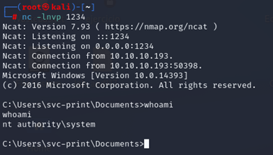<figcaption></figcaption></figure>


Si te he ayudado sígueme y apóyame en [Hack The Box ](https://app.hackthebox.com/profile/819073)

