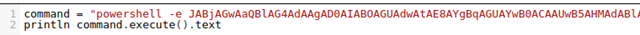

# 🏁 Jeeves

<figure><figcaption></figcaption></figure>

<table><thead><tr><th width="227">Datos</th><th width="288.3333333333333"> </th><th>Notas</th></tr></thead><tbody><tr><td>Nombre de la máquina: </td><td><a href="https://app.hackthebox.com/machines/114">Jeeves</a></td><td></td></tr><tr><td>IP de la máquina:</td><td>10.10.10.63</td><td></td></tr><tr><td>Sistema simulado: </td><td>Windows 10</td><td></td></tr><tr><td>Servicio vulnerado: </td><td>Jenkins</td><td></td></tr><tr><td>CVEs:</td><td></td><td></td></tr></tbody></table>

### 1. Enumeración y descubrimiento

Comenzamos el ejercicio realizando un scan mediante nmap a la IP 10.10.10.63, en la que está desplegada la máquina Jeeves revelando varios servicios desplegados por la máquina.

<figure><figcaption></figcaption></figure>

Al acceder por el navegador a la máquina nos encontramos la siguiente página:

<figure><figcaption></figcaption></figure>

En este paso para seguir descubriendo que tenemos en la máquina vamos a realizar fuzzing mediante la herramienta dirbuster.

<figure><figcaption></figcaption></figure>

Tras el análisis descubrimos el directorio /askjeeves el cual contiene un servidor Jenkins. Accedemos al panel de control y comenzamos a buscar por donde podremos realizar una intrusión.

<figure><figcaption></figcaption></figure>

En la consola de scripts descubrimos que podemos ejecutar código, comenzamos con:

<figure><figcaption></figcaption></figure>

Lo cual nos devuelve información sobre el sistema que estamos atacando:

<figure><figcaption></figcaption></figure>

Ahora iniciaremos una revershell desde powershell en Base64. Nos podemos ayudar de [https://revshells.com](https://revshells.com) para generar una. En ese momento nos ponemos en escucha en el puerto seleccionado y ganaremos acceso.

<figure><figcaption></figcaption></figure>

<figure><figcaption></figcaption></figure>

En este momento solo nos debemos desplazar hacia el directorio “Kohsuke” y tendremos acceso a la flag del usuario.

### 2. Escalada de privilegios

Mientras que realizábamos un reconocimiento dentro del servidor nos encontramos un archivo llamado “CEH.kdbx” el cual nos podría ayudar. Para realizar el traspaso del fichero y analizarlo creamos espacio de trabajo en Jenkins y copiamos el archivo dentro procediendo a descargarlo.

<figure><figcaption></figcaption></figure>

El archivo parece ser un archivo de contraseñas de Keepass. Por ello utilizaremos keepass2john para intentar conseguir las contraseñas.

<figure><figcaption></figcaption></figure>

Mediante Hashcat y el diccionario Rockyou intentaremos usar desencriptar la contraseña para poder acceder.

<figure><figcaption></figcaption></figure>

Tras menos de un minuto la contraseña extraída es “moonshine1”. Utilizamos la herramienta kpcli para listar las contraseñas que encontramos en el fichero.

<figure><figcaption></figcaption></figure>

Encontramos diversas contraseñas las cuales guardamos, pero nos damos cuenta de que en “Baskup Stuff” tenemos un string similar a un hash de Windows. Probamos si el hash es válido mediante crackmapexec y confirma su validez, de manera que ya tenemos un hash para acceder.

<figure><figcaption></figcaption></figure>

Utilizaremos el script psexec.py para acceder mediante el hash a una Shell de administrador.

<figure><figcaption></figcaption></figure>

Con esto tendríamos acceso total a la máquina.


Si te he ayudado sígueme y apóyame en [Hack The Box ](https://app.hackthebox.com/profile/819073)

