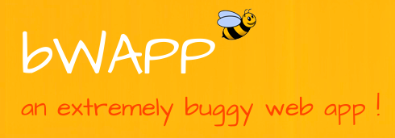

# 🐝 Bee Box bWAPP

Bee Box es una máquina virtual con una aplicación web utilizada para aprender a explotar vulnerabilidades web. Podemos obtener más información de la máquina en [Vunhub](https://www.vulnhub.com/entry/bwapp-bee-box-v16,53/) y descargarlo desde el siguiente [enlace](http://sourceforge.net/projects/bwapp/files/bee-box/bee-box\_v1.6.7z/download) .

<figure><figcaption></figcaption></figure>

### Instalación de Bee Box en VMware

Para instalar la máquina descargaremos el fichero de la página y descomprimiremos la máquina. Pulsando en el inciializador de VmWare iniciaremos la máquina la cual viene pre-configurada en sus specs y la desplegaremos en nuestro equipo.

Al iniciar la máquina por primera vez quizás tarde unos minutos más.

<figure><figcaption></figcaption></figure>

Tras esto se desplegará el equipo apareciendonos las diferentes opciones.

<figure><figcaption></figcaption></figure>

Dentro de la propia máquina podremos ver en el archivo ReadMe algunos detalles de diferentes vulnerabilidades las cuales podremos explotar como:

```
It includes:

*/ Injection vulnerabilities like SQL, SSI, XML/XPath, JSON, LDAP, HTML, iFrame, OS Command and SMTP injection
*/ Cross-Site Scripting (XSS), Cross-Site Tracing (XST) and Cross-Site Request Forgery (CSRF)
*/ Unrestricted file uploads and backdoor files
*/ Authentication, authorization and session management issues
*/ Arbitrary file access and directory traversals
*/ Local and remote file inclusions (LFI/RFI)
*/ Server Side Request Forgery (SSRF)
*/ XML External Entity Attacks (XXE)
*/ Heartbleed vulnerability (OpenSSL)
*/ Shellshock vulnerability (CGI)
*/ Drupal SQL injection (Drupageddon)
*/ Configuration issues: Man-in-the-Middle, cross-domain policy file, information disclosures,...
*/ HTTP parameter pollution and HTTP response splitting
*/ Denial-of-Service (DoS) attacks
*/ HTML5 ClickJacking, Cross-Origin Resource Sharing (CORS) and web storage issues
*/ Unvalidated redirects and forwards
*/ Parameter tampering
*/ PHP-CGI vulnerability
*/ Insecure cryptographic storage
*/ AJAX and Web Services issues (JSON/XML/SOAP)
*/ Cookie and password reset poisoning
*/ Insecure FTP, SNMP and WebDAV configurations
*/ and much more...
```

Dentro de su panel de control en `bwapp start` podremos desplegar las diferentes vulnerabilidades del servicio y comenzar a atacar la máquina.

<figure><figcaption></figcaption></figure>

