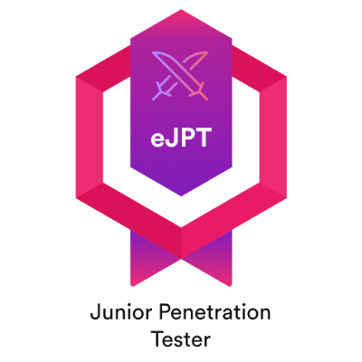

# 👨💻 ¿Quien soy?

## Presentación

Soy un trabajador jóven que desde niño ha sido aficionado a la informática y le ha atraído el Hacking. Desde hace unos años me estoy especializando en ciberseguridad, más concretamente del lado del Red Team, acudiendo a algunos congresos como el CiberWall, escuchando constantemente charlas y viendo tutoriales relaccionados con el campo. Es por ello que desde hace un tiempo estoy profesionalizando mis estudios de cara a poder dar el salto desde la parte de "mangament" de incidencias críticas hacía el pentesting puro. Siempre he compatibilizado estudios y trabajo, por lo que estudio mucho "online" desde hace un tiempo y de ello nació la idea de hacer este book. &#x20;

## Formación

He estudiado un grado superior en Administración de Sistemas Informáticos en Red (ASIR) en la UNED y seguí mi formación mediante un Master de Dirección de Ciberseguridad, Hacking Ético y Seguridad Ofensiva en EIP. Además realizo multitud de retos CTF en HTB. He comenzado a certificarme en tecnologías comenzando con la eJPTv2.

<figure><figcaption></figcaption></figure>

## Formación en progreso

Actualmente estoy dividiendo mi formación en varios ámbitos:

* Linux Profesional Institute Certificate 1 ([LPIC-1](https://www.lpi.org/es/our-certifications/lpic-1-overview))
* C1 Advanced English Level
* Proximamente comenzaré mi formación en la OSCP

\[Sobre cualquiera de los temas anteriores posiblemente iré escribiendo en otros books con el objetivo de no perderme en los apuntes y ayudar a que otros no se pierdan]

## Redes

**-Hack The Box:** [**and117**](https://app.hackthebox.com/profile/819073)

**-Github:** [**and1-17**](https://github.com/and1-17)

**-LinkedIn:** [**Antonio**](https://www.linkedin.com/in/antoniodseri47/)

